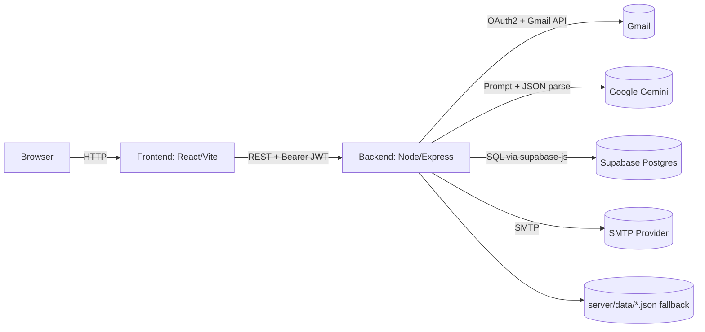

# Job Search Hub — Complete Project Documentation

_Last updated: 2026-04-07_

## Table of contents

- [1) What this application is](#1-what-this-application-is)
- [2) Why it is useful](#2-why-it-is-useful)
- [3) Tech stack](#3-tech-stack)
- [4) How the application works (step-by-step)](#4-how-the-application-works-step-by-step)
- [5) System architecture (high-level)](#5-system-architecture-high-level)
- [6) Repository hierarchy](#6-repository-hierarchy)
- [7) Frontend architecture](#7-frontend-architecture)
- [8) Backend architecture](#8-backend-architecture)
- [9) Data storage & database](#9-data-storage--database)
- [10) API endpoints (summary)](#10-api-endpoints-summary)
- [11) Environment variables](#11-environment-variables)
- [12) Run locally & with Docker](#12-run-locally--with-docker)
- [13) Security, privacy, and auditing](#13-security-privacy-and-auditing)
- [14) Repo audit (unwanted/outdated files or code)](#14-repo-audit-unwantedoutdated-files-or-code)
- [15) “Make it more beautiful” — idea board for your team](#15-make-it-more-beautiful--idea-board-for-your-team)

---

## 1) What this application is

**Job Search Hub** is a personal job search management app (a “job search command center”). It helps a candidate track job applications end-to-end — from wishlist → applied → screening → interview → offer/rejected — while also supporting the surrounding workflow:

- Gmail-powered job email sync (auto-detect job-related messages)
- Job pipeline board + job detail view (emails, timeline)
- Contacts (recruiters/network)
- Outreach log (follow-ups and response statuses)
- Reminders (deadlines, follow-ups) + calendar export
- Resume manager (upload and attach resume to a job)
- Interview prep (Q&A notes)
- Templates library (email/LinkedIn/WhatsApp) + “archive template” viewer

The repo is a monorepo with two main apps:

- `client/` → React + Vite frontend
- `server/` → Node.js + Express backend

---

## 2) Why it is useful

Job searching is mostly a **process management** problem:

- You apply to many roles over weeks/months.
- You receive many emails from different sources (ATS platforms, recruiters).
- You need to follow up consistently and not lose track of deadlines.

This app centralizes that workflow into one place:

- **Reduces manual data entry** by syncing Gmail and extracting company/role/status.
- **Makes follow-ups visible** using reminders and a “needs follow-up” view.
- **Improves consistency** using reusable outreach templates.
- **Keeps context together** (emails/timeline/resume/outreach/reminders around each role).

---

## 3) Tech stack

### Frontend

- React 18
- React Router
- Vite
- Recharts (charts)

### Backend

- Node.js (>= 18, Docker uses Node 20)
- Express
- CORS
- express-session (used for OAuth CSRF protection in one OAuth flow)
- multer (resume upload)
- node-cron (scheduled sync)
- nodemailer (SMTP for verification/OTP emails)

### Database

- Supabase (PostgreSQL) via `@supabase/supabase-js`
- Local JSON fallback files for development/demo mode under `server/data/`

### Integrations

- Gmail API via `googleapis` + Google OAuth2
- AI extraction: **Google Gemini** via `@google/generative-ai` (model used: `gemini-1.5-flash`)
- SMTP email (for OTP + verification links)

### Containerization

- Docker + Docker Compose

---

## 4) How the application works (step-by-step)

This section explains the **real user journey** and the **internal flow** behind it.

### Step 0 — Start the app

You run:

- Frontend at `http://localhost:5173`
- Backend at `http://localhost:3001`

(See setup in section [12](#12-run-locally--with-docker).)

### Step 1 — Sign in / create account

In the UI:

1. Open the site → you land on the Login page.
2. You can:
   - Register with email/password, or
   - Continue with Google

Internally:

- Frontend stores an auth token in localStorage (`jsh_auth_token`).
- Backend uses a lightweight JWT-style token (`HS256`) generated by `createAuthToken()`.
- All authenticated requests include `Authorization: Bearer <token>`.

### Step 2 — Email verification gate (required before Gmail connect)

Before connecting Gmail, the user must be email-verified.

In the UI:

1. If your email is not verified, the app routes you to `/verify-email`.
2. The page can auto-send a verification email (or you can request manually).
3. You click the link in your inbox → the app confirms verification.

Internally:

- Request link: `POST /auth/verify-email/request` (requires auth)
- Confirm link: `GET /auth/verify-email/confirm?token=...` (public)

### Step 3 — Connect Gmail (OAuth)

In the UI:

1. Click “Continue with Google” (login) or “Connect Gmail” (dashboard).
2. Google OAuth consent screen appears.
3. You approve read-only Gmail scope.

Internally:

There are **two OAuth patterns** currently present:

- **Pattern A: JSON-based OAuth**
  - `GET /auth/google-auth-url` returns an `authUrl`
  - Frontend redirects to it
  - Google redirects back to `/login?code=...`
  - Frontend calls `POST /auth/google-auth` with the code

- **Pattern B: Redirect-based OAuth**
  - `GET /auth/gmail` redirects to Google
  - `GET /auth/callback` handles the callback
  - Uses `express-session` to store/validate the `state` value (CSRF protection)
  - Enforces **Gmail account email must match the app account email**

Tokens are stored **per user** using `setTokensForUser()`.

### Step 4 — Sync jobs from Gmail

In the UI:

1. Click “Sync Jobs”.
2. The dashboard shows syncing state.

Internally:

- Manual trigger: `POST /jobs/sync`
- A background sync runs and returns quickly so the UI isn’t blocked.
- Sync logic:
  1. Fetch Gmail messages (query includes job-ish keywords).
  2. Parse sender/subject/body.
  3. Send a cleaned + sanitized email snippet to Gemini.
  4. Gemini returns JSON: company, role, status, recruiter info, etc.
  5. Jobs are created/updated, and emails are stored under the job.
  6. Status timeline is updated when status progresses.

### Step 5 — Use the dashboard modules

The dashboard navigation items are:

- Dashboard
- Job Tracker
- Resume Manager
- Contacts
- Templates
- Interview Prep
- Outreach
- Reminders

Key behaviors:

- **Job Tracker**: Kanban pipeline + expandable cards.
  - Each job can show Summary (email timeline mini cards), Email Log tab, Timeline tab.
  - Jobs can attach a resume.

- **Templates**: filter by type + search; copy template content.
  - Also includes an “Archive Templates” viewer that reads `.txt` templates from `docs/template-data/...`.

- **Reminders**: add reminder with type + due date; mark complete; export `.ics` calendar.

- **Outreach**: log outreach attempts + update response status.

### Optional Step — Enable Email Extraction (consent flow)

On Dashboard Home there is “Enable Email Extraction”, which opens a multi-step verification:

1. Request OTP (`/api/extract/request-otp`)
2. Verify OTP (`/api/extract/verify-otp`)
3. Verify token (`/api/extract/verify-email`)
4. Extraction enabled status (`/api/extract/status`)

Note: This flow depends on database tables for OTP and token storage.

---

## 5) System architecture (high-level)



Key idea: the backend is the **orchestrator** — it connects to Gmail, calls Gemini, writes to storage, and exposes a REST API for the UI.

---

## 6) Repository hierarchy

Top level:

- `client/` — frontend
- `server/` — backend
- `docs/` — architecture, deployment, database SQL migrations, template data

Quick tree (abridged):

```text
job-search-hub/
  client/
    src/
      App.jsx
      api/
        backend.js
        emailExtraction.js
      auth/
        AuthContext.jsx
      pages/
        Dashboard.jsx
        DashboardWrapper.jsx
        LoginPage.jsx
        ProfilePage.jsx
        VerifyEmailPage.jsx
      components/
        views/
          DashboardHomeView.jsx
          JobTrackerView.jsx
          TemplatesView.jsx
          OutreachView.jsx
          RemindersView.jsx
  server/
    index.js
    src/
      app.js
      config/env.js
      routes/
      services/
      store/
      security/
  docs/
    ARCHITECTURE.md
    DEPLOYMENT.md
    database/
    template-data/
  docker-compose.yml
  Dockerfile.backend
  Dockerfile.frontend
  .env.example
  PROJECT_DOCUMENTATION.md
```

### Frontend structure (`client/`)

- `client/src/App.jsx` — router + protected route logic
- `client/src/auth/AuthContext.jsx` — auth state + user bootstrap
- `client/src/api/backend.js` — backend API client
- `client/src/api/emailExtraction.js` — email extraction API client
- `client/src/pages/*` — route pages (Login, Dashboard, Profile, Verify Email)
- `client/src/components/*` — UI modules
- `client/src/components/views/*` — dashboard tab views
- `client/src/hooks/*` — state/action hooks (jobs, contacts, outreach, reminders, templates)
- `client/src/utils/*` — helpers (email merge, validation)

### Backend structure (`server/`)

- `server/index.js` — starts server + scheduler
- `server/src/app.js` — express app wiring (routes + middleware)
- `server/src/routes/*` — HTTP endpoints grouped by domain
- `server/src/services/*` — business logic (sync, extraction)
- `server/src/integrations/*` — Gmail integration
- `server/src/security/*` — DLP, token encryption, audit logs, rate limiting
- `server/src/store/*` — data store abstraction (Supabase + local JSON fallback)
- `server/data/` — persisted local JSON + uploads + audit logs (in Docker mounted as volume)

---

## 7) Frontend architecture

### Routing & page hierarchy

- `client/src/App.jsx`
  - `ProtectedRoute` checks:
    - authenticated
    - email verified (`user.is_email_verified`)
  - Routes:
    - `/login`
    - `/verify-email`
    - `/profile`
    - `/dashboard` and other dashboard subroutes (`/:route/*`)

### State and data loading

- `AuthProvider` loads current user from `GET /auth/me` if a stored token exists.
- `Dashboard.jsx` fetches initial data:
  - health
  - auth status (gmail connected)
  - jobs
  - analytics
  - contacts
  - reminders
  - outreach
  - resumes

### API client

- `client/src/api/backend.js` wraps fetch with:
  - `Authorization: Bearer ...`
  - JSON parsing + error handling

---

## 8) Backend architecture

### Express app composition

In `server/src/app.js`:

- Adds JSON parsing + CORS
- Adds session middleware (OAuth CSRF protection in one OAuth path)
- Registers route modules:
  - `/auth`
  - `/jobs` (protected)
  - `/resumes` (protected)
  - `/contacts` (protected)
  - `/reminders` (protected)
  - `/outreach` (protected)
  - `/templates` (protected)
  - `/api/extract` (protected)
  - `/health` (public)
  - `/mcp` (optional token-protected)

### Gmail sync scheduler

- `server/src/scheduler/syncScheduler.js` schedules a cron job using `SYNC_CRON`.
- It loops through users who have active OAuth tokens and syncs sequentially.

### Job extraction (AI)

- `server/src/services/jobExtractor.js`:
  - Cleans email body, removes boilerplate and links.
  - Sanitizes PII via `sanitizeEmailForAI()`.
  - Prompts Gemini to return **strict JSON**.
  - Normalizes status + email type.

---

## 9) Data storage & database

This project supports two modes:

1. **Supabase mode (recommended)**
   - Persistent multi-user storage.
   - Database schema is under `docs/database/`.

2. **Local JSON fallback (dev/demo)**
   - Files under `server/data/` (for example `local-store.json`).
   - Useful for quick demo without a DB, but some features (OTP/extraction) require DB tables.

### Important data concepts

- **Users**: stored in `app_users` table (Supabase) or local store fallback (`users-local-store.json`).
- **OAuth tokens**: stored per user; encryption supported via `TOKEN_ENCRYPTION_KEY`.
- **Jobs**: stored with owner user ID; includes embedded emails.
- **Resumes**: file uploaded to `server/data/uploads/resumes` and metadata stored.
- **Audit logs**: stored as daily JSON lines under `server/data/audit-logs/`.

---

## 10) API endpoints (summary)

All endpoints are relative to the backend base URL (default `http://localhost:3001`).

### Health

- `GET /health` → `{ status: "ok", version: "1.0.0" }`

### Auth (JWT)

- `POST /auth/login`
- `POST /auth/register`
- `GET /auth/me`
- `PATCH /auth/me`
- `POST /auth/change-password`

Email verification:

- `POST /auth/verify-email/request` (authenticated)
- `GET /auth/verify-email/confirm?token=...` (public)

Google OAuth login (JSON-style):

- `GET /auth/google-auth-url`
- `POST /auth/google-auth`

Gmail connect (redirect-style):

- `GET /auth/gmail`
- `GET /auth/callback`

Gmail status:

- `GET /auth/status`
- `POST /auth/disconnect`

### Jobs

- `GET /jobs`
- `POST /jobs` (create)
- `PATCH /jobs/:id` (update)
- `DELETE /jobs/:id`
- `POST /jobs/sync` (manual sync trigger)
- `GET /jobs/sync-status`
- `GET /jobs/analytics/weekly`
- `GET /jobs/analytics/daily`
- `GET /jobs/timeline/:id`

### Contacts

- `GET /contacts`
- `POST /contacts`
- `PATCH /contacts/:id`
- `DELETE /contacts/:id`

### Reminders

- `GET /reminders`
- `POST /reminders`
- `PATCH /reminders/:id`
- `DELETE /reminders/:id`

### Outreach

- `GET /outreach`
- `POST /outreach`
- `PATCH /outreach/:id`
- `DELETE /outreach/:id`

### Templates

- `GET /templates/archive/files`
- `GET /templates/archive/content?path=<relative_path>`

### Resumes

- `POST /resumes/upload` (multipart form-data)
- `GET /resumes`
- `GET /resumes/:id/view`
- `GET /resumes/:id/download`
- `PATCH /resumes/:id`
- `DELETE /resumes/:id`
- `GET /resumes/:id/versions`

### Email extraction verification

- `POST /api/extract/request-otp`
- `POST /api/extract/verify-otp`
- `POST /api/extract/verify-email`
- `GET /api/extract/status`
- `GET /api/extract/audit-log`

### MCP endpoints

The `/mcp/*` routes expose a tool-like API for external AI clients. Guardrails include:

- optional `MCP_AUTH_TOKEN` auth
- rate limiting
- allowed tool allowlist
- request auditing

---

## 11) Environment variables

Use `.env.example` as the source of truth.

### Required (backend)

- `GOOGLE_CLIENT_ID`
- `GOOGLE_CLIENT_SECRET`
- `REDIRECT_URI`
- `GEMINI_API_KEY`

### Recommended

- `SUPABASE_URL`
- `SUPABASE_SERVICE_ROLE_KEY`
- `SESSION_SECRET`
- `AUTH_TOKEN_SECRET`
- `TOKEN_ENCRYPTION_KEY`

### SMTP (email sending)

Used for:

- OTP emails (registration/extraction)
- Email verification links (depending on which code path you use)

Common vars:

- `SMTP_HOST`
- `SMTP_PORT`
- `SMTP_USER`
- `SMTP_PASS`
- `SMTP_SECURE`
- `SMTP_FROM_EMAIL`
- `SMTP_FROM_NAME`
- `OTP_SEND_MODE` (`console` is convenient in development)

Important note (repo consistency):

- `.env.example` uses `SMTP_FROM_EMAIL`/`SMTP_FROM_NAME`.
- Some verification code paths use `MAIL_FROM`.

If you see “from address” issues, align on one naming convention.

---

## 12) Run locally & with Docker

### Local development (recommended for coding)

Backend:

```bash
npm install
cp .env.example .env
npm run dev:server
```

Frontend:

```bash
npm --prefix client install
npm run dev:client
```

### Docker Compose (good for end-to-end test)

```bash
docker compose up --build
```

URLs:

- Frontend: `http://localhost:5173`
- Backend: `http://localhost:3001/health`

Stop:

```bash
docker compose down
```

---

## 13) Security, privacy, and auditing

What’s implemented:

- **JWT auth** for API access (`Authorization: Bearer ...`).
- **Email verification gating** before Gmail connection.
- **OAuth CSRF state** (in the redirect-based flow).
- **Rate limiting** for sync (`RATE_LIMIT_SYNC_PER_HOUR`).
- **Audit logging** to daily files (`server/data/audit-logs/`).
- **DLP sanitization** masks sensitive patterns before sending data to the AI model.
- **Token encryption** for stored OAuth tokens (AES-256-GCM) when configured.

---

## 14) Repo audit (unwanted/outdated files or code)

This repo includes helpful docs, but also some items that look like **artifacts** or **outdated references**.

### Likely outdated / confusing docs

- `docs/DEPLOYMENT.md` and `DEPLOYMENT.md` mention **Anthropic/Claude** in multiple places.
  - Current implementation uses **Google Gemini** (`GEMINI_API_KEY`) for extraction.

### Likely temporary / artifact files

These are useful as historical records, but they’re not “product documentation”:

- `DOCKER_TEST_REPORT.md`
- `PRE_DEPLOYMENT_TEST_REPORT.md`
- `SMOKE_REPORT.md`


### Potentially unnecessary / “not part of runtime”

- `.env.docker` contains test credentials and outdated variables (includes `ANTHROPIC_API_KEY`, uses different ports). Consider removing it or renaming it to something clearly non-production (and ensuring it is never used for real keys).
- `IMAGE_GENERATION_PROMPTS.md` looks like internal prompt notes (not required for runtime).

### Code-level notes (cleanup opportunities)

- `server/src/services/emailExtractionService.js` imports `uuid` but does not use it.
  - Root `package.json` does not list `uuid`, so this import is risky (can break runtime if dependency isn’t present).
- `server/src/routes/authRoutes.js` contains overlapping auth patterns (multiple register flows + two OAuth flows).
  - Works, but increases maintenance cost and makes documentation confusing.

---

## 15) “Make it more beautiful” — idea board for your team

These are UI/UX improvement ideas based on what’s already built (no new product scope required):

- **Unify visual language across modules**: ensure each dashboard tab uses the same header, spacing, button styles, and empty states.
- **Reduce cognitive load in Job Tracker**: make “Summary / Email Log / Timeline” more scannable and keep primary actions (Edit / Delete / Status) consistent.
- **Make verification flows feel first-class**: the app currently has two verification concepts (email verification + extraction verification). Consider merging the UX copy and making the steps consistent.
- **Improve onboarding**: a short first-run checklist on Dashboard (verify email → connect Gmail → sync jobs → add first reminder).
- **Tighter typography and spacing**: standardize text sizes for headings, labels, helper text.

If you want, I can also create a smaller “Team Review Checklist” doc for design/UX feedback based on this repo.
